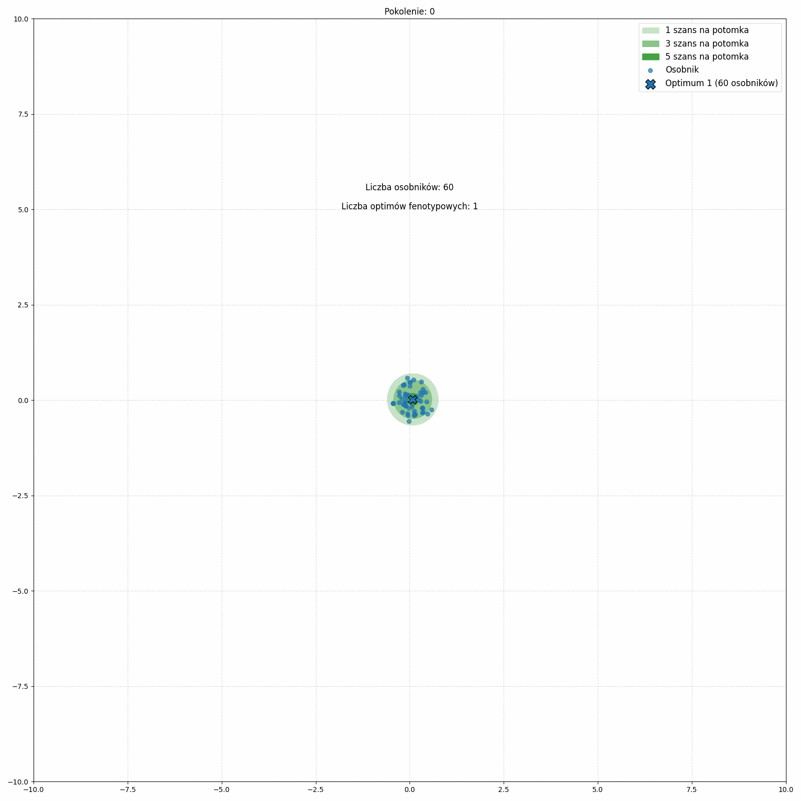

# To jest kopia projektu, więc czas dodania pierwszego commitu jest mocno po deadline. Proszę sprawdzać projekt z repozytorium koleżanki 
Model ewolucyjny oparty o geometryczny model Fishera (GMF)  
Aby uruchomić symulację należy wywołać komendę:  
`python main.py`  
Aby uruchomić tworzenie heatmapy należy przejść do folderu heatmap_simulation oraz wywołać komendę:  
`python run_simulation.py` 
Przykładowa symulacja ewolucji populacji z siedmioma optimum.  

